Kong官方的文档已经比较详细，读者应该优先参考官方文档。此文档主要用于个人记录，相当于一个备忘录，因此可能会缺失很多细节。

首先，部署Kong Gateway有很多种方式，本文使用的是最简单的一种：使用Docker手动部署容器。

# Network

```bash
docker network create kong-network
```

# Database

这里采用本地部署Postgres容器的方式。

```bash
docker volume create kong-database-volume

docker run -d \
    --name kong-database \
    --network kong-network \
    -p 5432:5432 \
    -e "POSTGRES_USER=kong" \
    -e "POSTGRES_DB=kong" \
    -e "POSTGRES_PASSWORD=kongpass" \
    -v kong-database-volume:/var/lib/postgresql/data \
    postgres:16

```

数据迁移：

```bash
docker run --rm --network kong-network \
    -e "KONG_DATABASE=postgres" \
    -e "KONG_PG_HOST=kong-database" \
    -e "KONG_PG_PASSWORD=kongpass" \
    kong/kong:3.9.1 kong migrations bootstrap

```

# Kong Gateway

```bash
docker run -d \
    --name kong-gateway \
    --network kong-network \
    -e "KONG_DATABASE=postgres" \
    -e "KONG_PG_HOST=kong-database" \
    -e "KONG_PG_USER=kong" \
    -e "KONG_PG_PASSWORD=kongpass" \
    -e "KONG_PROXY_ACCESS_LOG=/dev/stdout" \
    -e "KONG_ADMIN_ACCESS_LOG=/dev/stdout" \
    -e "KONG_PROXY_ERROR_LOG=/dev/stderr" \
    -e "KONG_ADMIN_ERROR_LOG=/dev/stderr" \
    -e "KONG_ADMIN_LISTEN=0.0.0.0:8001" \
    -e "KONG_ADMIN_GUI_PATH=/manager" \
    -e "KONG_ADMIN_GUI_URL=http://yourdomain.com:8002/manager" \
    -p 80:8000 \
    -p 443:8443 \
    -p 8001:8001 \
    -p 8002:8002 \
    kong/kong:3.9.1

```

注意：为了能够通过公网域名访问Kong Manager，配置了以下环境变量：
* KONG_ADMIN_GUI_PATH=/manager
* KONG_ADMIN_GUI_URL=http://yourdomain.com:8002/manager

既然配额了域名，那么就必然要解决SSL证书的问题。Kong自带ACME插件，刚好可以给自己的域名颁发证书，并且能够自动刷新证书。


通过浏览器访问：`http://yourdomain.com:8002/manager`即可进入Kong Manager的UI界面，方便配置Kong。 如图所示：

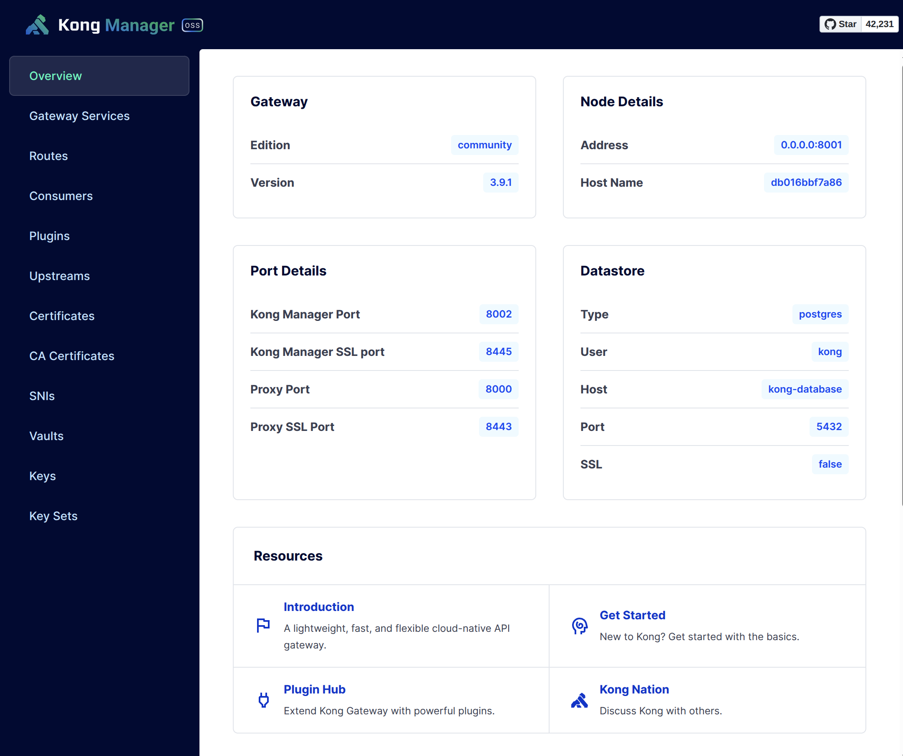


# ACME Plugin

要利用ACME插件实现给域名颁发证书，主要有三个步骤：
* 创建一个acme-service，是一个虚假的service，它部负责ACME Challenge等工作。
* 创建一个acme-route，挂在上述acme-service下。
* 创建一个acme-plugin，它是**全局的**，此插件实现了ACME的核心功能。


## acme-service

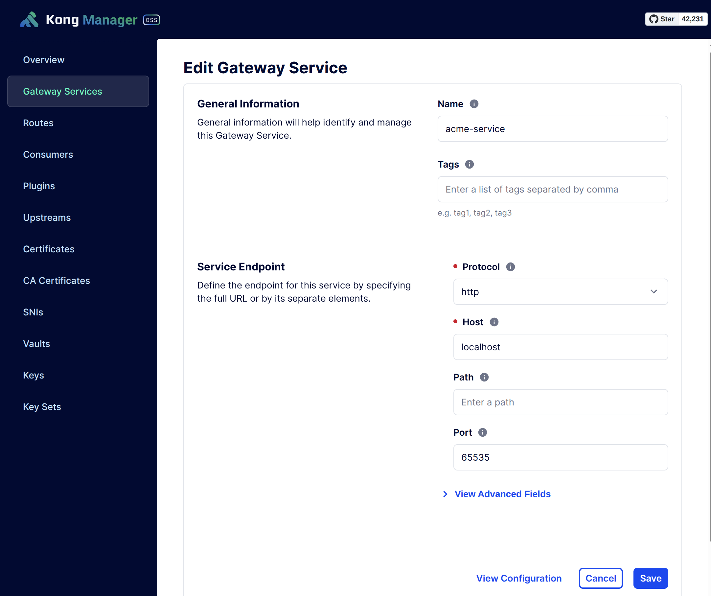

可以看到：
* host: localhost
* port: 65535

都是无意义的值。

## acme-route

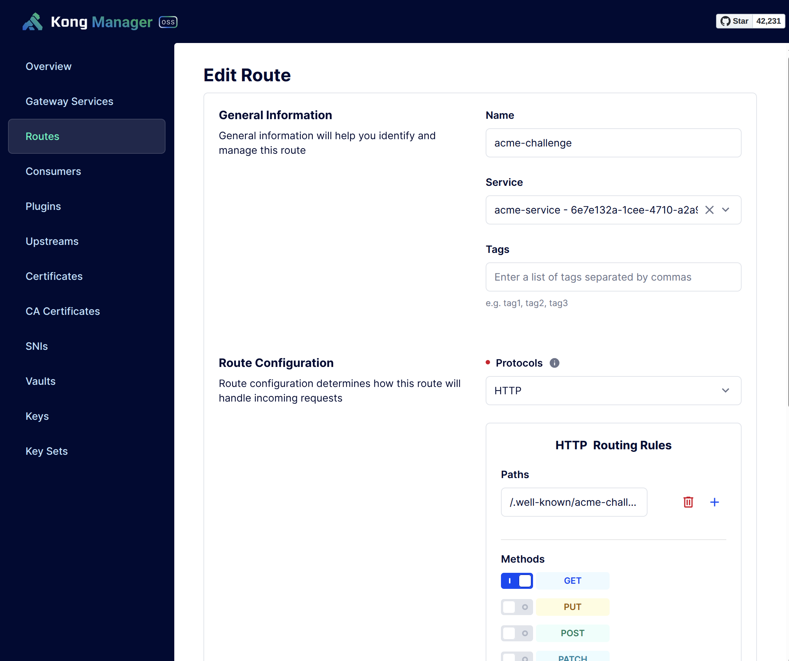

注意：
* 取消勾选 **Strip Path**

## acme-plugin

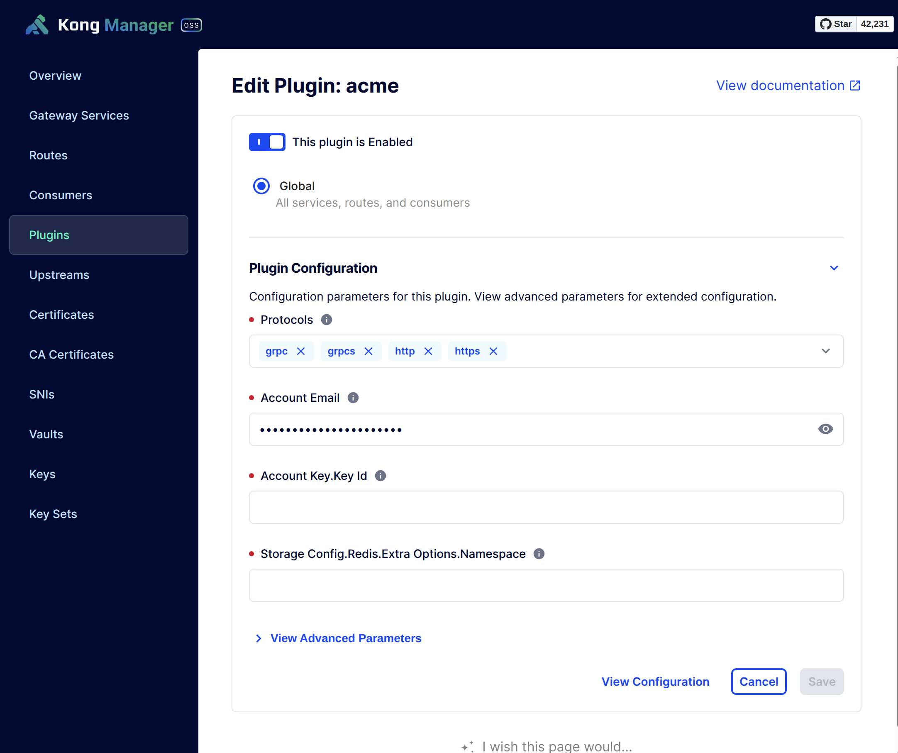


注意:
* 你可以在`domains`选项添加一个或者多个域名
* 或者你可以选择`Allow Any Domain`


至此，ACME插件配置完毕。


## Create SSL Certificate

可以通过Kong Admin API来触发**证书生成**

```bash
curl http://localhost:8001/acme -d host=yourdomain.com
```

过几分钟你会看到如下输出:

```bash
{"message":"certificate for host yourdomain.com is created"}
```


然后你可以在Kong Manager / Certificates 看到:

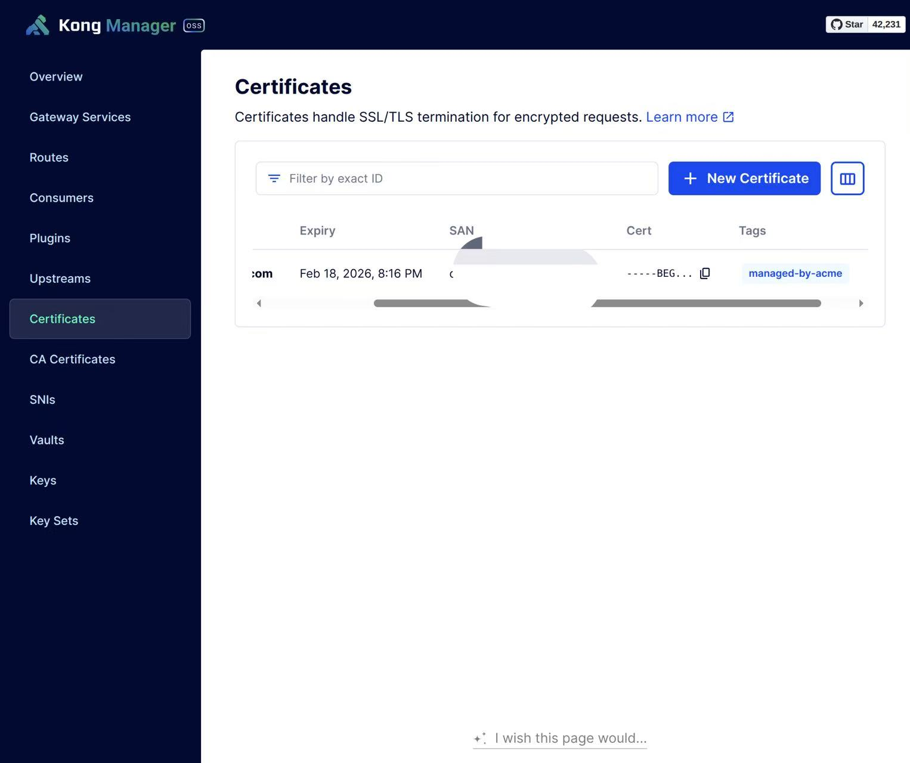


# 实现Kong Manager域名的安全访问（SSL + Auth）

想要使用域名来访问Kong Manager,并且支持SSL安全访问，需要进行一些配置变更:
* 修改Kong Gateway的环境变量
* 创建Kong Manager Service & Route
* 创建Kong Admin Service & Route


## 修改Kong Gateway的环境变量

* 修改`KONG_ADMIN_GUI_PATH`和`KONG_ADMIN_GUI_URL`配置
* 修改`KONG_ADMIN_LISTEN`和`KONG_ADMIN_API_URL`配置

举例:
```bash
    -e "KONG_ADMIN_LISTEN=0.0.0.0:8001,0.0.0.0:443 ssl" \
    -e "KONG_ADMIN_GUI_PATH=/kong-manager" \
    -e "KONG_ADMIN_GUI_URL=https://kong.yourdomain.com:443/kong-manager" \
    -e "KONG_ADMIN_API_URL=https://kong.yourdomain.com:443" \

```

注意！！！ **修改完之后不要重新部署！！！** 需要等后续所有配置完成之后再来重新部署。

## 创建Kong Manager Service & Route

因为涉及到环境变量的变更,导致在浏览器通过Kong Manager UI来更改配置,可能会遇到垮域问题,所以直接用 Admin API来处理最方便:

```bash
curl -X POST 'http://localhost:8001/services' \
  -H 'content-type: application/json' \
  --data-raw '{"name":"kong-manager-service","tags":null,"read_timeout":60000,"retries":5,"connect_timeout":60000,"ca_certificates":null,"client_certificate":null,"write_timeout":60000,"port":8002,"url":"http://localhost:8002"}'
```

response:
```json
{
    "tags": null,
    "ca_certificates": null,
    "path": null,
    "enabled": true,
    "connect_timeout": 60000,
    "tls_verify": null,
    "tls_verify_depth": null,
    "host": "localhost",
    "protocol": "http",
    "name": "kong-manager-service",
    "id": "ec7710e3-05ab-4891-9005-9c0d2aa80480",
    "retries": 5,
    "client_certificate": null,
    "created_at": 1763689846,
    "updated_at": 1763689846,
    "port": 8002,
    "write_timeout": 60000,
    "read_timeout": 60000
}
```

create route:
```bash
curl -X POST 'http://localhost:8001/services/ec7710e3-05ab-4891-9005-9c0d2aa80480/routes' \
  -H 'content-type: application/json' \
  --data-raw '{"name":"kong-manager-route","protocols":["http","https"],"https_redirect_status_code":426,"strip_path":false,"preserve_host":false,"request_buffering":true,"response_buffering":true,"tags":[],"service":{"id":"ec7710e3-05ab-4891-9005-9c0d2aa80480"},"methods":null,"hosts":["kong.yourdomain.com"],"paths":["/kong-manager"],"headers":null,"regex_priority":0,"path_handling":"v0","sources":null,"destinations":null,"snis":null}'
```

response:
```json
{
    "tags": [],
    "strip_path": false,
    "sources": null,
    "destinations": null,
    "regex_priority": 0,
    "methods": null,
    "paths": [
        "/kong-manager"
    ],
    "service": {
        "id": "ec7710e3-05ab-4891-9005-9c0d2aa80480"
    },
    "name": "kong-manager-route",
    "response_buffering": true,
    "https_redirect_status_code": 426,
    "protocols": [
        "http",
        "https"
    ],
    "path_handling": "v0",
    "id": "4c8b1b53-2448-4f59-8084-9ae58be93149",
    "headers": null,
    "preserve_host": false,
    "hosts": [
        "kong.yourdomain.com"
    ],
    "created_at": 1763689973,
    "updated_at": 1763689973,
    "snis": null,
    "request_buffering": true
}
```


## 创建Kong Admin Service & Route

create service:

```bash
curl -X POST 'http://localhost:8001/services' \
  -H 'content-type: application/json' \
  --data-raw '{"name":"kong-admin-service","tags":null,"read_timeout":60000,"retries":5,"connect_timeout":60000,"ca_certificates":null,"client_certificate":null,"write_timeout":60000,"port":8001,"url":"http://localhost:8001"}'

```

response:

```json
{
    "tags": null,
    "ca_certificates": null,
    "path": null,
    "enabled": true,
    "connect_timeout": 60000,
    "tls_verify": null,
    "tls_verify_depth": null,
    "host": "localhost",
    "protocol": "http",
    "name": "kong-admin-service",
    "id": "fc4894e6-67bf-4f17-88d5-8bbad39789d0",
    "retries": 5,
    "client_certificate": null,
    "created_at": 1763689549,
    "updated_at": 1763689549,
    "port": 8001,
    "write_timeout": 60000,
    "read_timeout": 60000
}

```

create route:

```bash
curl -X POST 'http://localhost:8001/services/fc4894e6-67bf-4f17-88d5-8bbad39789d0/routes' \
  -H 'content-type: application/json' \
  --data-raw '{"name":"kong-admin-route","protocols":["http","https"],"https_redirect_status_code":426,"strip_path":false,"preserve_host":false,"request_buffering":true,"response_buffering":true,"tags":[],"service":{"id":"fc4894e6-67bf-4f17-88d5-8bbad39789d0"},"methods":null,"hosts":["kong.yourdomain.com"],"paths":["/"],"headers":null,"regex_priority":0,"path_handling":"v0","sources":null,"destinations":null,"snis":null}'
```

response:

```json
{
    "tags": [],
    "strip_path": false,
    "sources": null,
    "destinations": null,
    "regex_priority": 0,
    "methods": null,
    "paths": [
        "/"
    ],
    "service": {
        "id": "fc4894e6-67bf-4f17-88d5-8bbad39789d0"
    },
    "name": "kong-admin-route",
    "response_buffering": true,
    "https_redirect_status_code": 426,
    "protocols": [
        "http",
        "https"
    ],
    "path_handling": "v0",
    "id": "124de03d-1b0a-4472-b8e3-0e31a3f3a36b",
    "headers": null,
    "preserve_host": false,
    "hosts": [
        "kong.yourdomain.com"
    ],
    "created_at": 1763689715,
    "updated_at": 1763689715,
    "snis": null,
    "request_buffering": true
}
```

## 配置Kong Manager的认证插件

我们使用的Kong Gateway是开源版本，Kong Manager也是开源版本，默认是没有访问控制的。在开启了域名访问的情况下（意味着公网可以访问），会非常危险。

为此，我们可以这样解决：
* 在服务器开启IP白名单，只有你的IP可以访问
* 给Kong Manager增加认证插件


服务器的IP访问控制，这里不提。我们重点讲解如何给Kong Manager增加认证机制。

上述小节我们给kong manager & kong admin都创建了service & route，那么很自然的，我们的认证插件可以放在这两个service或者route上。考虑到可能会在service上增加routes,所以我们把认证插件放到service上，会安全一些。

那么我们使用哪种认证插件会比较合适呢？我们这里使用**Basic Auth**，主要原因是：
* 浏览器对于Basic Auth有很好的支持，会在需要认证的地方弹出Basic Auth认证表单，我们无需更改Kong Manager的任何UI


注意：**如果你在Kong Manager UI配置遇到问题，请转用Kong Admin API，它是万能的！！！**


### 配置Basic Auth插件

给Kong Manager Service配置Basic Auth插件：


给Kong Admin Service配置Basic Auth插件：


### 配置ACL插件

仅仅拥有Basic Auth插件是不够的，因为只要Kong上有其他地方也有Basic Auth的Credentials，那么也会可以登陆&访问Kong Manager，这实际上是一种越权。为了避免这在情况，我们还需要ACL插件，来控制哪些Basic Auth的Credentials可以访问Kong Manager。

给Kong Manager Service配置ACL插件：
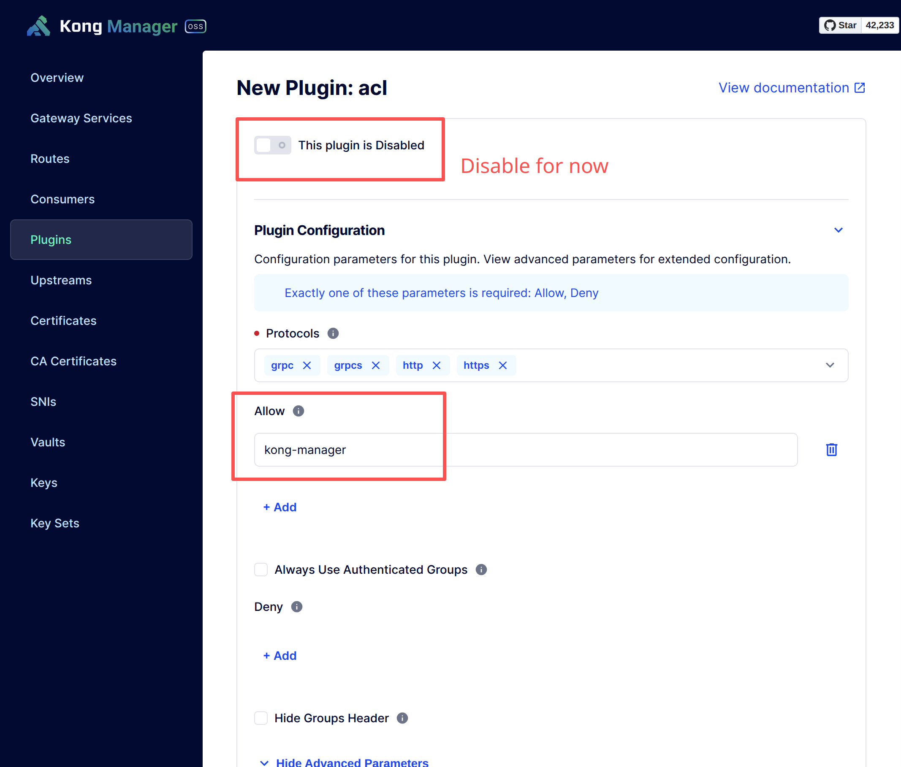


给Kong Admin Service配置ACL插件：
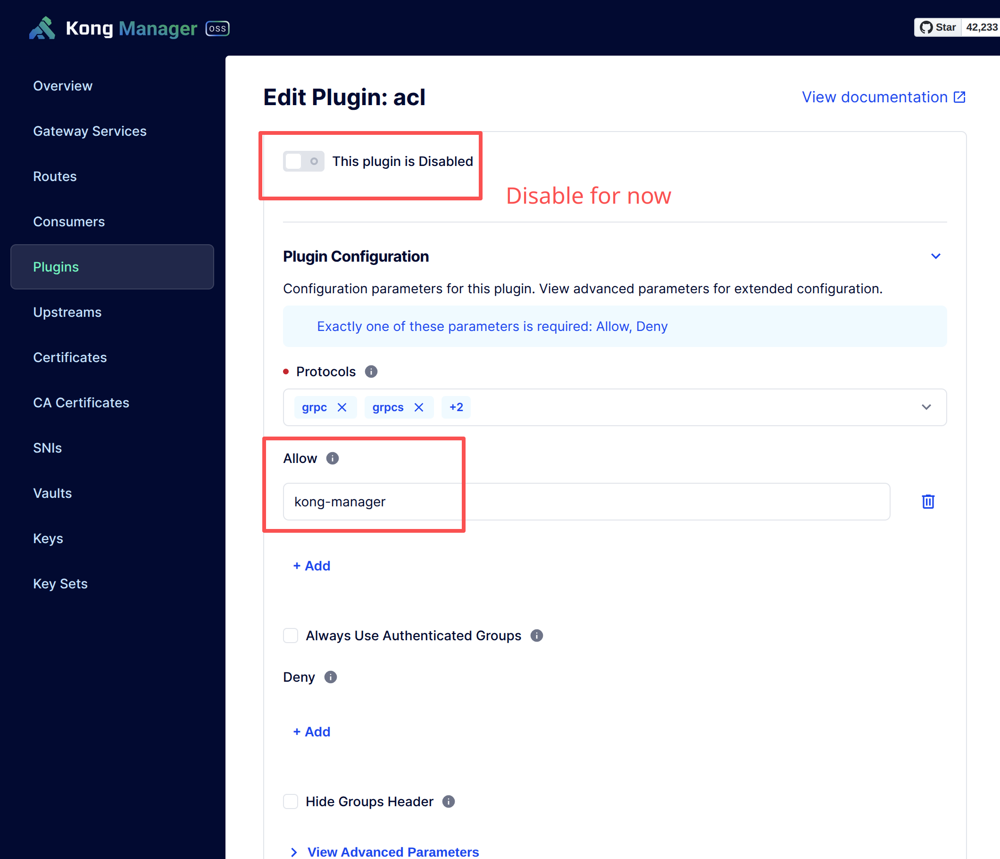

这里ACL插件的**Allow**就是**Group Name**，我们稍后会在Consumer里配置。


### 配置Kong Manager Consumer

我们新建一个Kong Manager专用的Consumer，来给Basic Auth认证一个独立可以区分的身份。

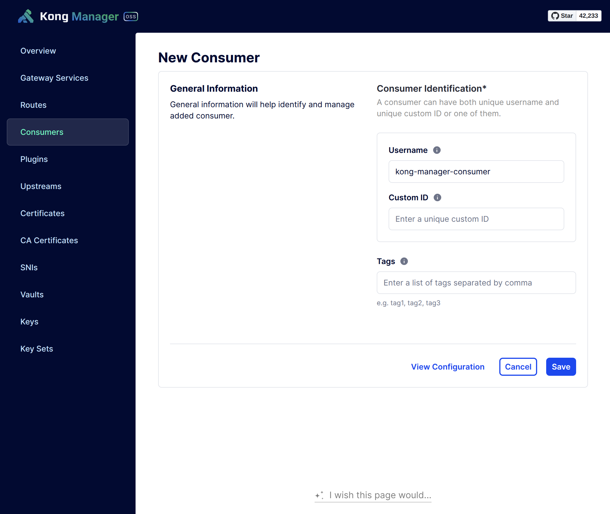

然后，我们给这个Consumer添加具体的Credentials：
* 配置Basic Auth Credentials,只有在配置了Basic Auth插件的情况下才可以配置Basic Auth Credentials
* 配置ACL Credentials，只有在配置了ACL插件的情况下才可以配置ACL Credentials

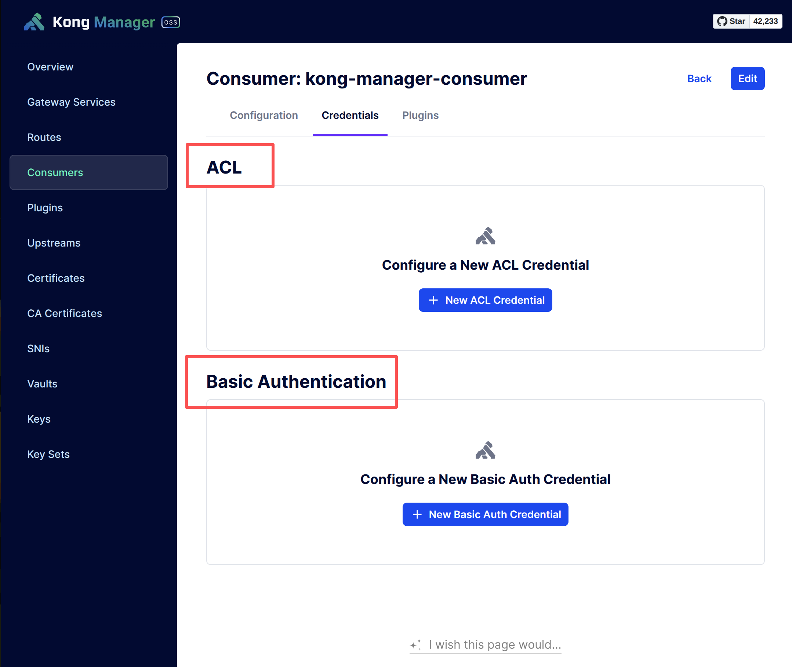


配置ACL Credentials:
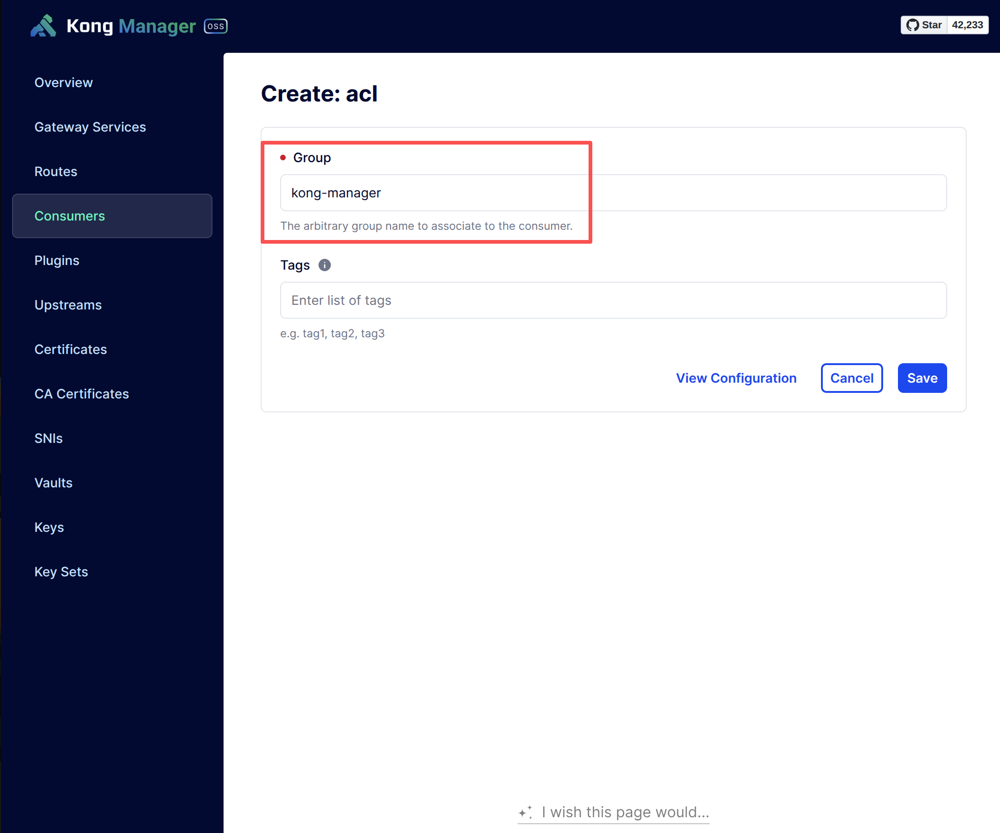

注意这里的**Group Name**要和插件保持一致。


配置Basic Auth Credentials:
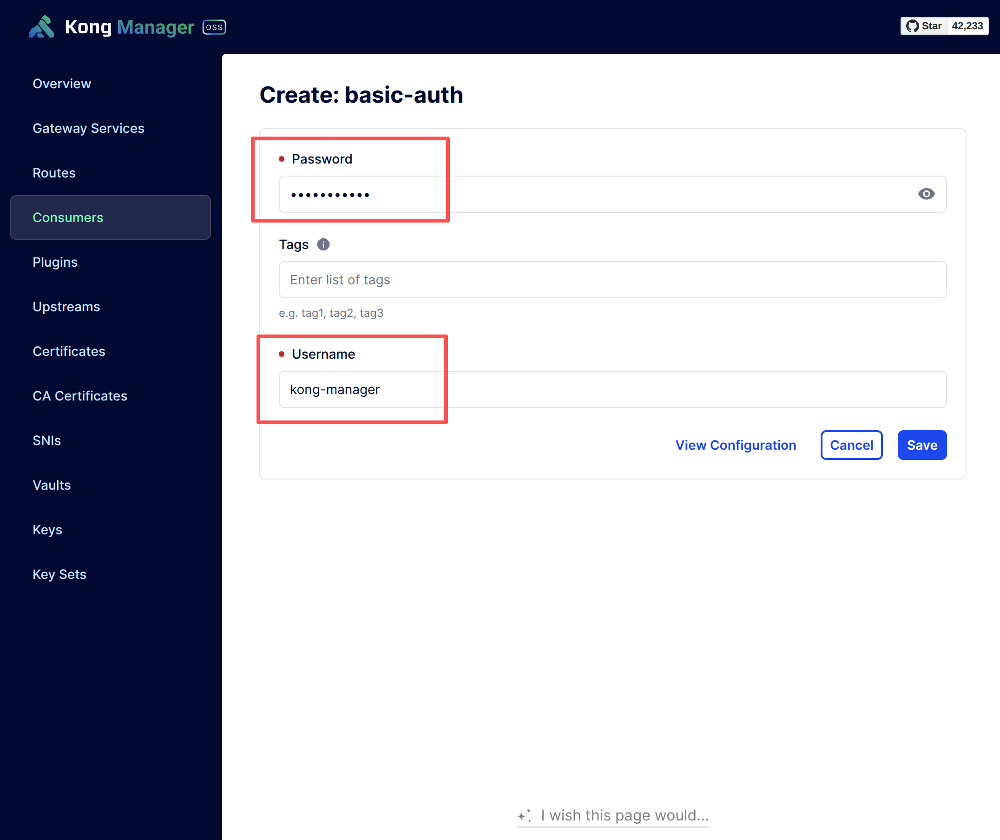

Usernamee & Password自己随意设置，保证安全性即可。


配置完Consumer Credentials之后，可以看到列表：
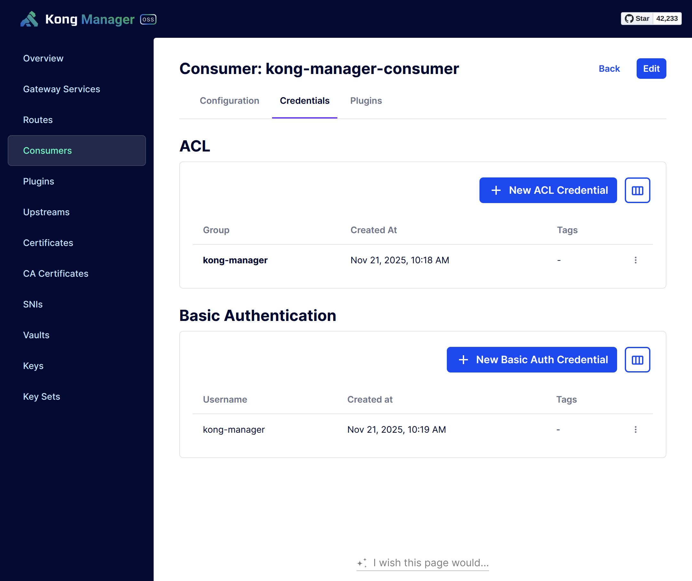


### 开启Service下的插件

开启插件即可，包括Kong Manager & Kong Admin Service。


### 重新部署Kong Gateway

至此，所有配置更新完毕，重新部署Kong Gateway，以便让环境变量生效。


浏览器访问：https://kong.yourdomain.com/kong-manager

会弹出Basic Auth 认证表单：
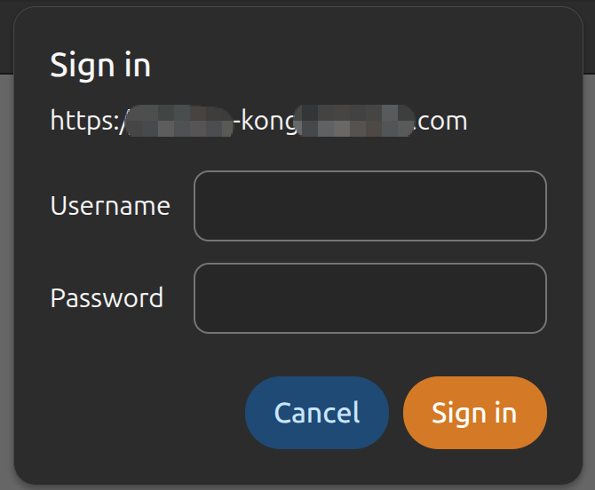


输入之前设置的Username & Password即可进入Kong Manager UI。

